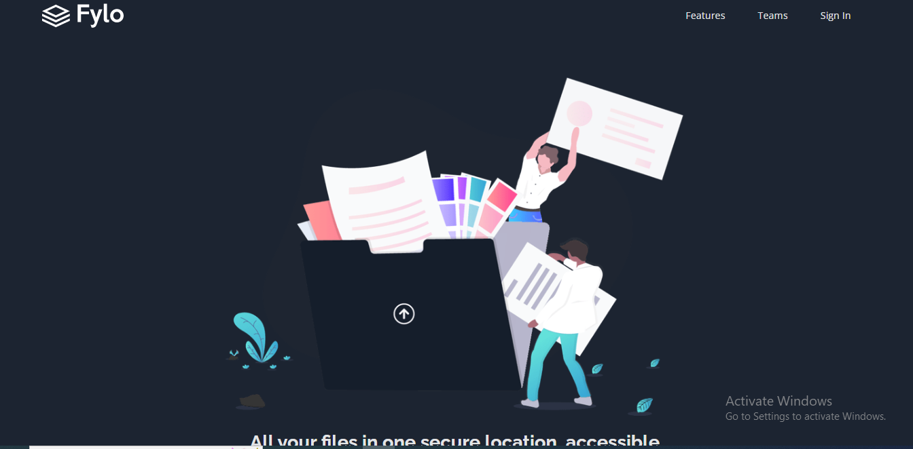

# Frontend Mentor - Fylo dark theme landing page solution

This is a solution to the [Fylo dark theme landing page challenge on Frontend Mentor](https://www.frontendmentor.io/challenges/fylo-dark-theme-landing-page-5ca5f2d21e82137ec91a50fd). Frontend Mentor challenges help you improve your coding skills by building realistic projects. 

## Table of contents

- [Overview](#overview)
  - [The challenge](#the-challenge)
  - [Screenshot](#screenshot)
  - [Links](#links)
- [My process](#my-process)
  - [Built with](#built-with)
  - [What I learned](#what-i-learned)
  - [Continued development](#continued-development)
  - [Useful resources](#useful-resources)
- [Author](#author)

## Overview

### The challenge

Users should be able to:

- View the optimal layout for the site depending on their device's screen size
- See hover states for all interactive elements on the page

### Screenshot

### Links

- Solution URL: [Add solution URL here](https://github.com/Winchestre/fylo)
- Live Site URL: [Add live site URL here](https://winchestre.github.io/fylo/)

## My process

### Built with

- Semantic HTML5 markup
- CSS custom properties
- Flexbox
- CSS Grid
- Mobile-first workflow

### What I learned
Initially, i struggled with a whole lot of things during the course of completing this challenge including centering divs (lol! yes), flexbox and most especially positioning of elements... yikes!!!. I have a much better understanding of SOME of these properties with the help of incredible resource persons littered all over the internet. Thanks to Kevin Powell's (https://www.youtube.com/kepowob) videos on css positioning as well as the stackoverflow community. This landing page is designed to dynamically respond to screen sizes as small as 280px; a process made easy by my mobile-first approach (inspired by Kevin). I'm excited to have completed (sought of) this challenge and i'm looking forward to completing other challenges so as to build my skillsets to provide solutions to real world challenges.

### Continued development

Moving forward, i would focus more on implementing functionality to my web pages using Javascript and a framework like React.js. I would also be working on writing well structured code. 

### Useful resources

- [Ems and Rems](https://www.youtube.com/watch?v=_-aDOAMmDHI&list=PPSV) - This helped me to understand the concepts of EMs and REMs.
- [CSS Positioning](https://www.youtube.com/watch?v=P6UgYq3J3Qs&list=PPSV) - This is an amazing article which helped me finally understand css positioning. I'd recommend it to anyone still learning this concept.

## Author

- Website - [Solomon Bassey](https://www.your-site.com)
- Frontend Mentor - [Winchestre](https://www.frontendmentor.io/profile/Winchestre)
- Twitter - [@Die_Feuhrer](https://www.twitter.com/Die_Feuhrer)
